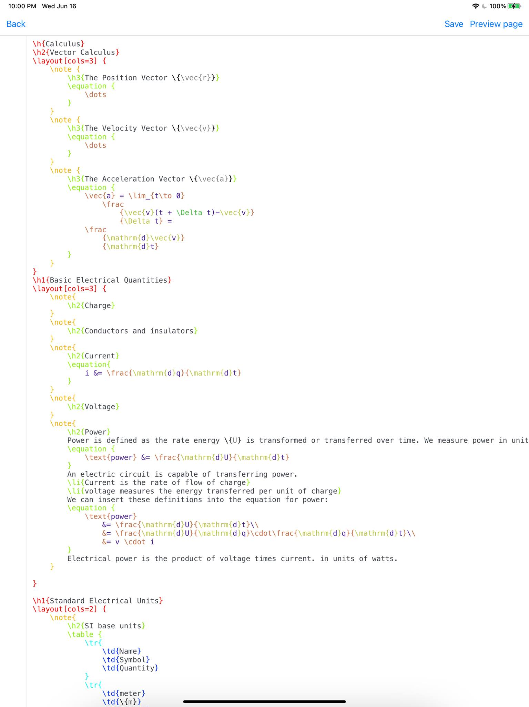

# Work in progress...

Not yet ready for public consumption; please check back in a couple of months. 

Ideally this will be usable for school this coming fall. 

# NOTE

Implementation wise, there is a lot here that you may not necessarily see.

For instance this was used in an IOS iPad app experiment, as you can see in the old photo.



As you can see in the above screenshot, syntax highlighting in Swift was calling out to rust over a C FFI that
transmitted source code span offsets that swift would then render. 

Overall, most syntax highlighting is based on simple patterns, but in here I was playing with
custom syntax highlighting based on parsing the source code into an AST which has much
more contextual information and therefore I could -for instance- highlight opening and
closing braces based on the indentation level (i.e. see attached image).


## Example

The end result of the following example will be similar to what you see [over here](https://colbyn.github.io/school-notes-spring-2020).

```
...

\note[boxed] {
    \h3{Symmetric Equation of a Line}
    Given
    \equation {
        t &= \frac{x - x_1}{x_2-x_1} = \frac{x - x_1}{\Delta_x}\\
        t &= \frac{y - y_1}{y_2-y_1} = \frac{y - y_1}{\Delta_y}\\
        t &= \frac{z - z_1}{z_2-z_1} = \frac{z - z_1}{\Delta_z}
    }
    Therefore
    \equation {
        \frac{x - x_1}{Delta_x}
            &= \frac{y - y_1}{\Delta_y}
            = \frac{z - z_1}{\Delta_z}\\
                \frac{x - x_1}{x_2-x_1}
            &= \frac{y - y_1}{y_2-y_1}
            =  \frac{z - z_1}{z_2-z_1}
    }
    \hr
    \h4{Rationale}
    We rewrite \{r = r_0 + a = r_0 + t v} in terms of \{t}.
    That is
    \equation{
        x &= x_1 + t(x_2-x_1) = x_1 + t\;Delta_x\\
        t\;Delta_x  &= x - x_1 = t(x_2-x_1)\\
        t &= \frac{x - x_1}{x_2-x_1} = \frac{x - x_1}{Delta_x} \\\\
        y &= y_1 + t(y_2-y_1) = y_1 + t\;\Delta_y\\
        t\;\Delta_y  &= y - y_1 = t(y_2-y_1)\\
        t &= \frac{y - y_1}{y_2-y_1} = \frac{y - y_1}{\Delta_y} \\\\
        z &= z_1 + t(z_2-z_1) = z_1 + t\;\Delta_z\\
        t\;\Delta_z &= z - z_1 = t(z_2-z_1) \\
        t &= \frac{z - z_1}{z_2-z_1} = \frac{z - z_1}{\Delta_z}
    }
}
\!where {
    {\Delta_x} => {\colorA{\Delta_x}}
    {\Delta_y} => {\colorA{\Delta_y}}
    {\Delta_z} => {\colorA{\Delta_z}}
    {x_1} => {\colorB{x_1}}
    {y_1} => {\colorB{y_1}}
    {z_1} => {\colorB{z_1}}
}
```

